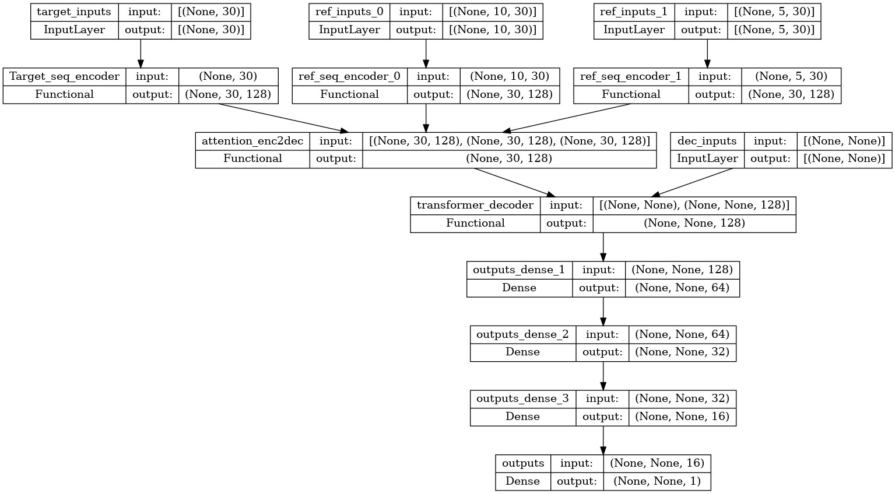
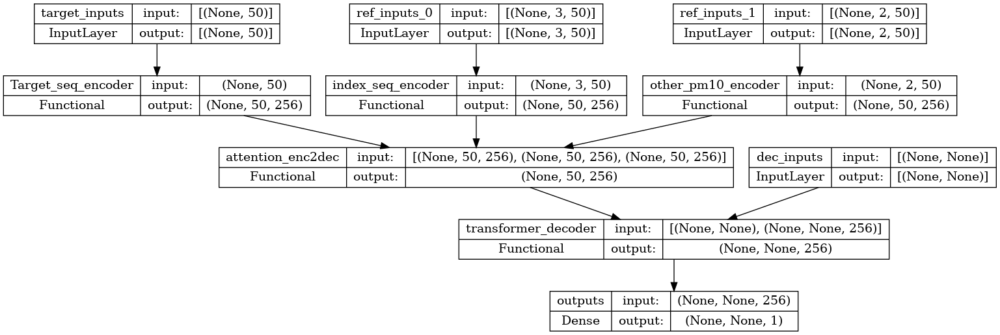
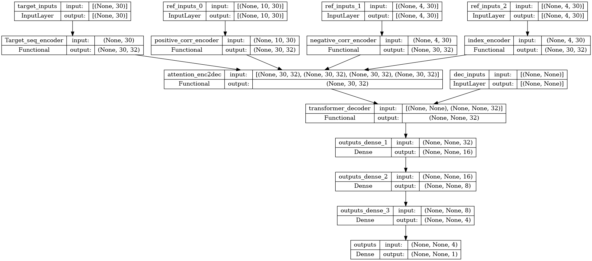

# MEaI_transformer
*__Multi Encoders and Inputs transformer__*

multi-encoder와 multi-Input 구조를 가진 장기 시계열 예측을 위한 Transformer 구조

## 주요 모델 구조

### 멀티 인풋 인코더 구조
  

### 전체 모델 구조 예시
  
------------------------------------

## (22년 추계 데이터마이닝 학회) 실험 모델

### 사용 데이터
기간 : 2016/01/01 00:00:00 ~ 2021/12/31 23:00:00  
> __날씨__
> - [기상자료개방포털](https://data.kma.go.kr/)  
>
> 기온, 강수, 풍속, 풍향, 습도, 기압, 일조, 일사, 시정, 관악/서울/수원 pm10,  
> (전운량(10분위),중하층운량(10분위),최저운고(100m ))  
>
> __코스피 주식__
> - pandas_datareader, FinanceDataReader 패키지  
> - [한국은행 경제통계시스템](https://ecos.bok.or.kr/)  

### 실험 모델

서울 미세먼지 예측에 사용된 구조  
  

KOSPI 예측에 사용된 구조  
  
